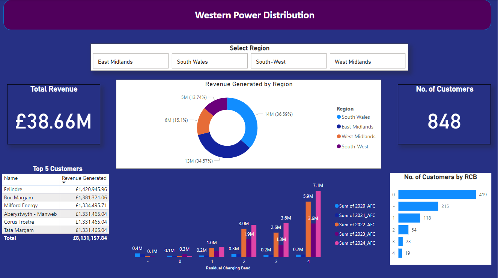

# Western Power Distribution Analysis
___  

## Description
___
This project builds a scalable Excel financial model for a power distribution company, automating 5-year fixed charge calculations across multiple network regions and customer bands, eliminating manual rebuilds when onboarding new regions.

## Aim and Objectives
___
This analysis provides insight into power consumption patterns and revenue generation. This will be achieved by:
- Calculating Annual Import Fixed Charges (AFC) for all customers from their Import Fixed Charges (IFC).
- Analysing customer distribution (with respect to their Residual Charging Band) across all four (4) regions studied.
- Calculating Year-on-Year percentage change for each customer

## Dashboard  
This is a screenshot of the dashboard created to aid visualisation of my analysis  

## Table of Contents
___
- [Description](#description)
- [Aim and Objectives](#aim-and-objectives)
- [Dashboard](#dashboard)
- [Skills Demonstrated](#skills-demonstrated)
- [Data Sources](#data-sources)
- [Data Cleaning and Preprocessing](#data-cleaning-and-preprocessing)
- [Data Analysis](#data-analysis)
- [Usage Instructions](#usage-instructions)
- [Further Improvements](#further-improvements)

### Skills Demonstrated
___
- VLOOKUP
- Power BI
- DAX
- Power Query
- Data Cleaning
- Financial Modelling

### Data Sources
___
Datasets for this project were obtained from a Power Distribution Company in ".xlsx" format. 

### Data Cleaning and Preprocessing
___

### Data Analysis
___

### Usage Instructions
- Data collection and cleaning were performed on Microsoft Excel. Download and install MS Excel on your machine. If you have not already, this software can be downloaded [here](https://www.microsoft.com/en-gb/microsoft-365/excel?ef_id=_k_7f6ebb9ae2b216bcec3edc83309dd670_k_&OCID=AIDcmmp20rgnjr_SEM__k_7f6ebb9ae2b216bcec3edc83309dd670_k_&msclkid=7f6ebb9ae2b216bcec3edc83309dd670).
- Ensure all data files are located in the same directory and maintain a consistent naming pattern for all files.
> [!WARNING]
> Saving files on an online platform (e.g. OneDrive) could cause any link in the file to load more slowly, throwing up warning alerts. So, preferably, save files on the desktop or the "C Drive"

---

