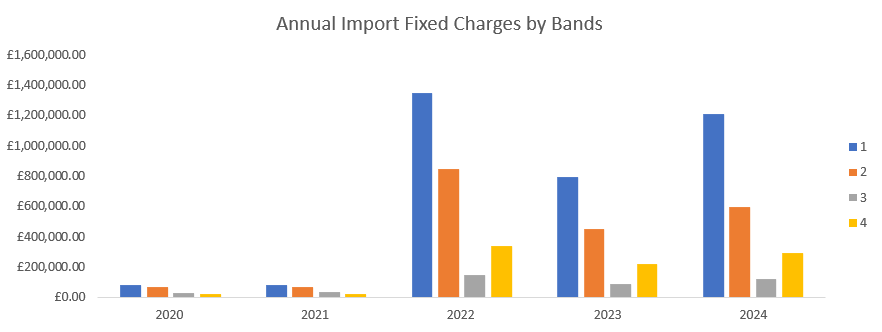
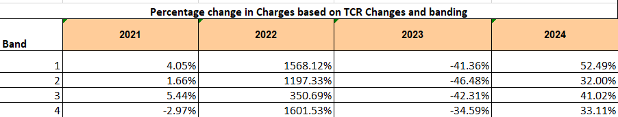
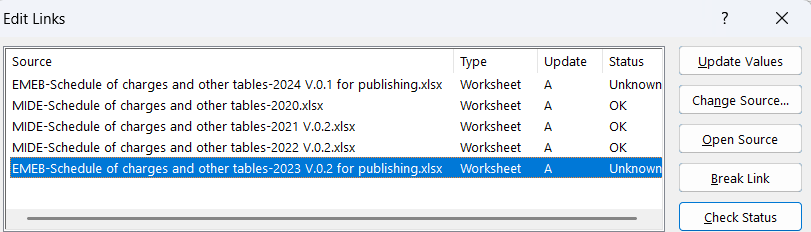
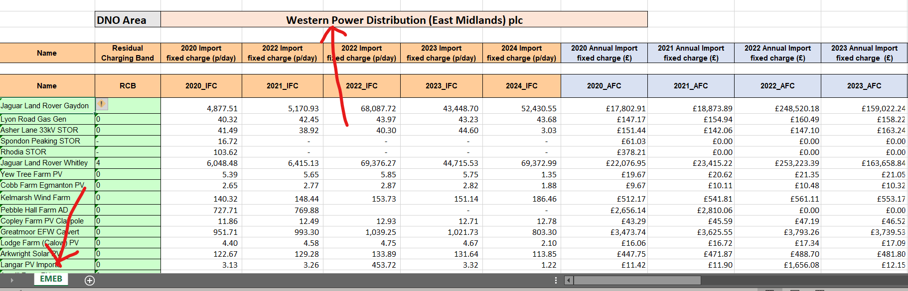
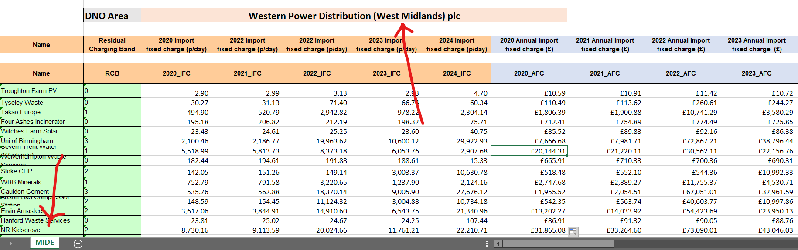

# Financial Model - Western Power Distribution
___  

## Description  
This project builds a scalable Excel financial model for a power distribution company, automating 5-year fixed charge calculations across four (4) network regions and customer bands, eliminating manual rebuilds when onboarding new regions.

---

## Aim and Objectives  
This analysis provides insight into power consumption patterns and revenue generation. This will be achieved by:
- Calculating Annual Import Fixed Charges (AFC) for all customers from their Import Fixed Charges (IFC).
- Analysing customer distribution (with respect to their Residual Charging Band) across all four (4) regions studied.
- Calculating Year-on-Year percentage change for each customer

---

## Table of Contents  
- [Description](#description)
- [Aim and Objectives](#aim-and-objectives)
- [Skills Demonstrated](#skills-demonstrated)
- [Data Sources](#data-sources)
- [Data Cleaning](#data-cleaning)
- [Preprocessing for Modelling](#preprocessing-for-modelling)
- [Analysis and Modelling](#analysis-and-modelling)

---

## Skills Demonstrated  
- VLOOKUP
- SUMIF
- IFERROR
- Financial Modelling

--- 

## Data Sources  
Datasets for this project were obtained from a Power Distribution Company in ".xlsx" format. 

---

### Data Cleaning
The dataset needed no cleaning as it was received clean.

---

### Preprocessing for Modelling
To prepare the datasets for modelling:
* Ensure all data files are located in the same directory and maintain a consistent naming pattern for all files.
> [!WARNING]
> Saving files on an online platform (e.g. OneDrive) could cause any link in the file to load more slowly, throwing up warning alerts. So, preferably, save files on the desktop or the "C Drive"

---

### Analysis
Analysis was performed on one region - East Midlands (EMEB), using the template provided [here](Template_Excel_Model_EMEB.xlsx). This will then be used as a model for automating calculations across the remaining regions. Analysis performed include: 
    - Annual fixed charges for all years, based on Bands
    - YoY change for all Bands  

  

* Band 1 (blue) is the dominant cost driver in every year it appears materially. In 2022 it reached approximately £1.35M — the single highest value in the entire dataset — and in 2024 it sits at roughly £1.2M. This band alone accounts for the majority of total annual fixed charges in both those years, suggesting it represents either the largest customer segment or the highest-tariff customer category.
* The 2022 spike is the most significant event in the data. Every band reached its peak in 2022. This simultaneous surge across all bands strongly suggests an external driver — most likely the 2022 UK energy price shock following the Russia-Ukraine conflict — rather than organic customer growth. This is worth flagging as a structural event rather than a business trend.
* All four bands are compressed very close to zero in 2020 and 2021, with values likely below £100K each. The contrast with 2022 is stark. This could reflect suppressed energy demand during the COVID-19 pandemic, lower underlying tariff rates in those years, or a smaller customer base prior to growth.
* The year-on-year increases in 2022 are extraordinary by any measure. Band 4 led with +1,601.53%, followed by Band 1 at +1,568.12%, Band 2 at +1,197.33%, and Band 3 at +350.69%. These are not growth figures — they appear to be evidence of a fundamental regulatory or tariff restructuring under the Targeted Charging Review (TCR), implemented to reform how fixed network costs are recovered. Crucially, Band 3 was the least affected at 350%, suggesting it may have been partially sheltered from the TCR redistribution, or that it had a different starting base that made the absolute change less severe in percentage terms.
* The bar chart showed Band 4 as the second smallest in absolute £ value, yet it had the highest percentage increase in 2022 at +1,601.53%. This apparent contradiction resolves when you consider that Band 4 likely had an extremely low base charge before TCR — meaning even a modest absolute increase produced an enormous percentage figure. TCR disproportionately impacted customers who previously paid very little in fixed charges.
* All four bands fell significantly in 2023: Band 2 fell the hardest at -46.48%, followed by Band 1 at -41.36%, Band 3 at -42.31%, and Band 4 at -34.59%. However, combining this with the bar chart confirms that despite these large percentage drops, charges in 2023 remained far above 2020/21 levels. A -46% fall from a 1,197% increase still leaves charges roughly 600% above the pre-TCR baseline. The 2023 reduction likely reflects the first annual tariff reset after the initial TCR shock, not a policy reversal.
* Band 1 is the most volatile and highest-risk band. Across all four years, Band 1 experienced the second-largest 2022 spike (+1,568%), the second-largest 2023 drop (-41.36%), and the largest 2024 rebound (+52.49%). Combined with its dominance in absolute £ terms from the bar chart, Band 1 customers represent both the greatest revenue exposure and the greatest forecasting uncertainty. Any financial model for this company must treat Band 1 as a high-sensitivity variable.

---

### Modelling
The template above was used as a model to replicate similar analysis for a new region - West Midlands (MIDE). To do this:
1. A duplicate of the template worksheet (EMEB) was created and named according to the new region to be analysed (MIDE)
2. The Data links were changed on the new worksheet. To do this:
    - Click on the 'Data' tab, and then click on 'Edit links'. This will reveal all linked workbooks
    - Replace each workbook with corresponding one from the Midlands region. i.e, replace 'EMEB 2020' workbook with 'MIDE 2020'. To achieve this, from the open dialog box, select the workbook to be replaced, then click on 'Change Source' (as shown below).
    - Next, select the corresponding new region's workbook.
    - Repeat the steps above for year 2021, 2022, 2023, and 2024. Click 'Close' when all the source links are changed.
3. Steps I & II above were repeated for other regions, using the datasets [here](Projuect_files)  

  

> [!WARNING]
> As the source links are being changed, some values in the data may disappear. This is absolutely normal. All the values and 'DNO Area' should update (as shown below) once all the source links are changed.  

  
  

---

### Conclusion
This model is functional and has been tested in production. It succesfully automates 5-year fixed charge calculations across multiple network regions and customer bands, eliminating manual rebuilds when onboarding new regions.

---
